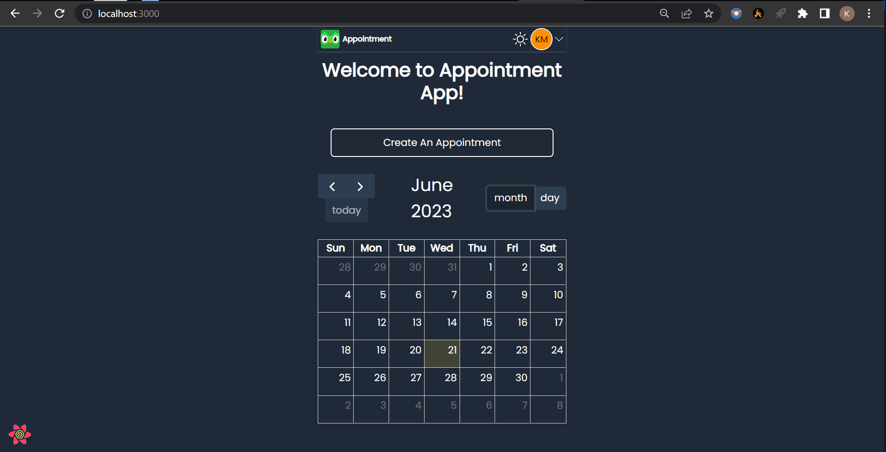

# Appointment App - A calenderly clone

An appointmentp-app is a software used by individuals to streamline their service appointments. By using the app, users can know and choose their preferred appointment times according to the available time slots.

## Table of contents

- [Overview](#overview)
  - [Features](#features)
  - [Screenshots](#screenshots)
  - [Links](#links)
  - [Demo Account](#demo-account)
  - [Built with](#built-with)
- [Getting started](#getting-started)
  - [Prerequisites](#prerequisites)
  - [Installation](#installation)
  - [Usage](#usage)
- [Authors](#authors)
- [Contributing](#🤝-contributing)
- [License](#📝-license-mit)

## Overview

### Features

- Login, Register, Resest Password for users and Social login(Google).
- Dark mode and light mode themes
- Rich text input for description
- FullCalender API integration to view available time slots.
- Cron job to send email reminder 5 minutes prior to their appointments.

### Screenshots



### Links

- Live Site URL: [Appointment App](https://appointmently.netlify.app)
- Solution URL: [Github](https://github.com/chilliesdev/appointment-app)

### Demo Account

- **Email**: `Beulah_Metz90@hotmail.com`
- **Password**: `password`

### Built With

- Typescript
- ReactJs
- Redux
- React Query
- Tailwind CSS
- NestJs
- NodeJs
- Express
- PostgreSQL
- Prisma ORM
- Jest
- Pactum
- Docker

## Getting Started

This is an example of how you may give instructions on setting up your project locally.
To get a local copy up and running follow these simple example steps.

### Prerequisites

This is an example of how to list things you need to use the software and how to install them.

- npm

  ```sh
  npm install npm@latest -g
  ```

### Installation

1. Get your Google Client ID at [Google Developers Console](https://console.cloud.google.com/apis)
2. Clone the repo

```sh
git clone https://github.com/chilliesdev/appointment-app
```

3. Install yarn concurrently and prisma globally

```sh
npm install --global yarn concurrently prisma
```

4. Create a shared environment variable file

```sh
.env.shared
```

5. Add the following keys to ".env.shared" file

```env
CLIENT_REACT_APP_SERVER_URL=http://localhost:8000
CLIENT_REACT_APP_CLIENT_ID

SERVER_DATABASE_URL
SERVER_JWT_SECRET
SERVER_DEFAULT_PASSWORD
SERVER_MAIL_HOST
SERVER_MAIL_USER
SERVER_MAIL_PASSWORD
SERVER_MAIL_FROM
SERVER_REMINDER_TIME
```

6. Run

```sh
yarn start
```

### Usage

Go to [http://localhost:8000](http://localhost:8000) to view the app

## Authors

👤 **Kayode Mathew**

- GitHub:[@chilliesdev](https://github.com/chilliesdev)
- Twitter: [@MatthewKayode14](https://twitter.com/MatthewKayode14)
- LinkedIn: [Kayode Matthew](https://www.linkedin.com/in/kayode-matthew-16995a1a9/)

## 🤝 Contributing

Contributions, issues, and feature requests are welcome!
Feel free to check the issues page. Show your support
Give a ⭐️ if you like this project!

## 📝 License MIT

This project is [MIT](./LICENSE) licensed.
